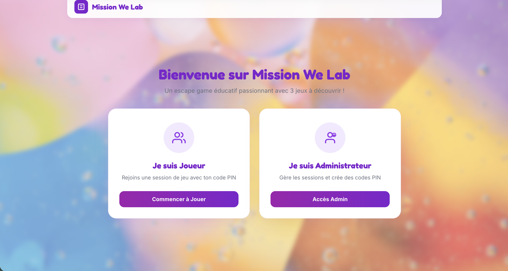
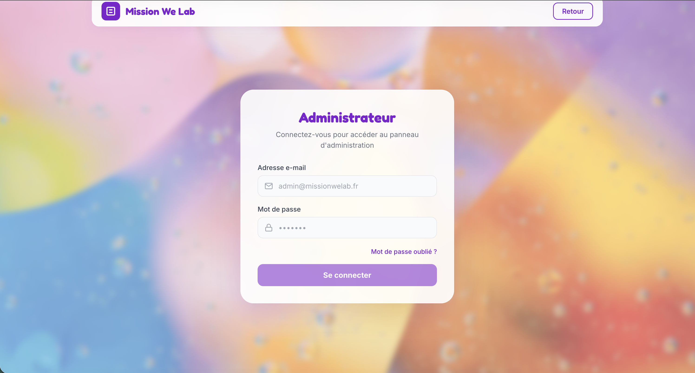
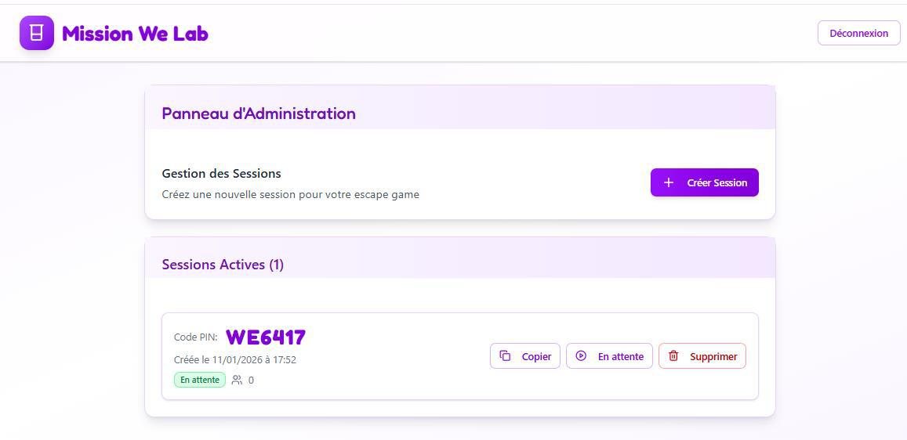
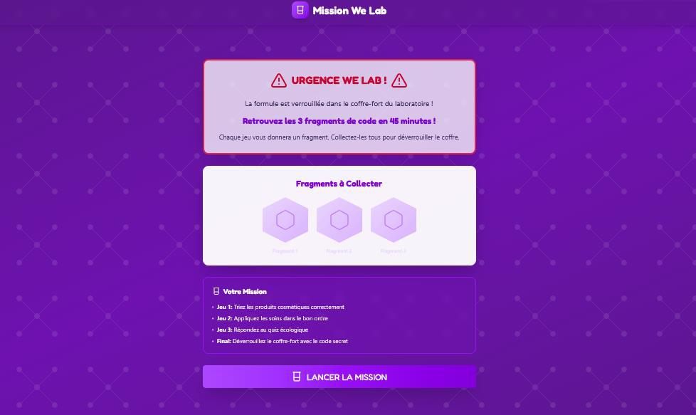
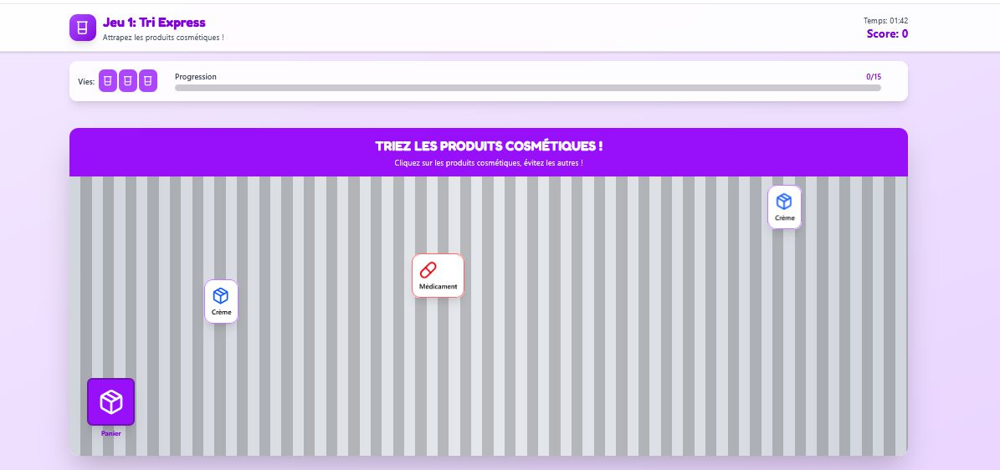
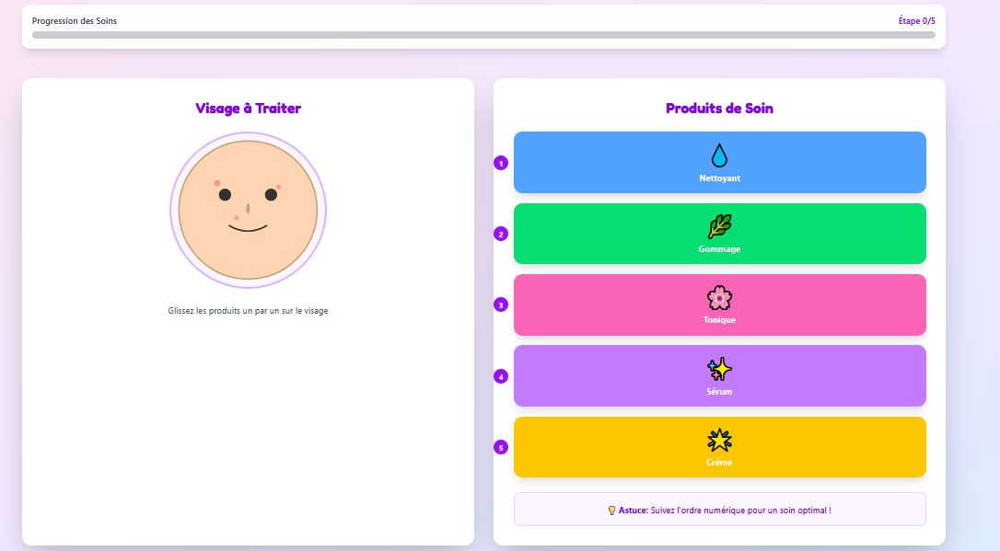
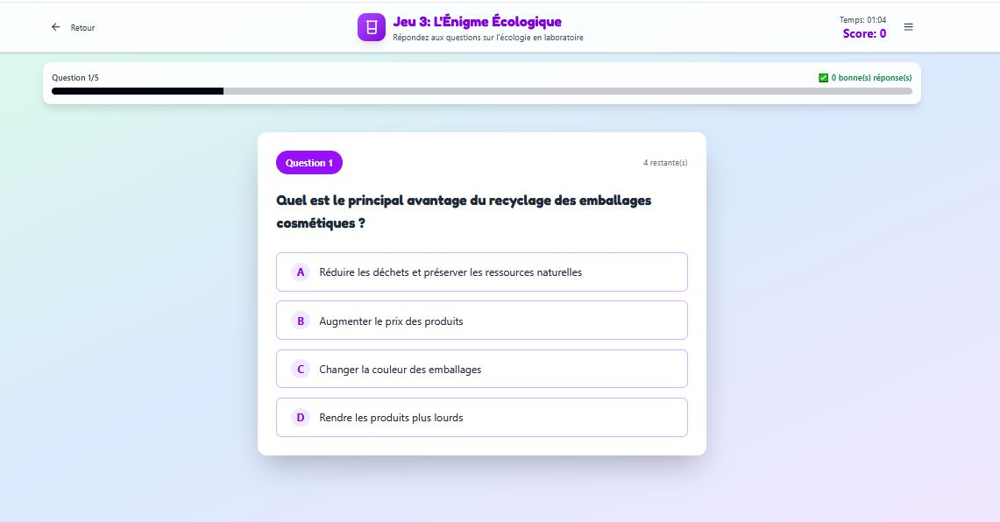
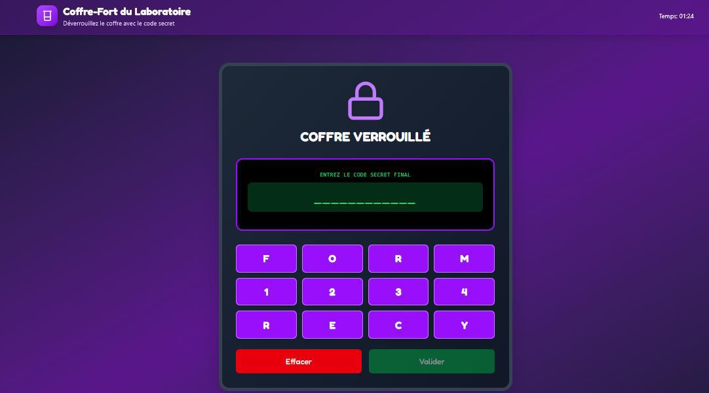

# Escape Game — La Formule Parfaite

> **Projet académique** : Jeu d'évasion pédagogique sous forme de mini-jeux en ligne.
> Le joueur doit compléter 3 défis (Tri Express, Séquence, Quiz) pour débloquer les fragments d'un code secret, puis valider la formule finale dans le coffre-fort du laboratoire.

---

## Table des matières

1. [Technologies utilisées](#technologies-utilisées)
2. [Prérequis](#prérequis)
3. [Installation & Lancement](#installation--lancement)
   - [Commandes Docker](#commandes-docker)
   - [Base de données](#base-de-données)
   - [Données de test (Fixtures)](#données-de-test-fixtures)
4. [Architecture du projet](#architecture-du-projet)
5. [Guide de jeu](#guide-de-jeu)
   - [1. Connexion Administrateur](#1-connexion-administrateur)
   - [2. Créer une session](#2-créer-une-session)
   - [3. Rejoindre la session (Joueur)](#3-rejoindre-la-session-joueur)
   - [4. Lancer la mission](#4-lancer-la-mission)
   - [5. Mini-jeu 1 : Tri Express](#5-mini-jeu-1--tri-express)
   - [6. Mini-jeu 2 : Séquence](#6-mini-jeu-2--séquence)
   - [7. Mini-jeu 3 : Quiz Écologique](#7-mini-jeu-3--quiz-écologique)
   - [8. Phase finale : Le Coffre-fort](#8-phase-finale--le-coffre-fort)
   - [9. Victoire ou Défaite](#9-victoire-ou-défaite)
6. [API Backend — Points d'entrée](#api-backend--points-dentrée)
7. [Design et Maquettes](#design-et-maquettes)
8. [Commandes utiles au quotidien](#commandes-utiles-au-quotidien)
9. [Dépannage](#dépannage)

---

## Technologies utilisées

| Couche | Technologie | Version |
|--------|-------------|---------|
| **Backend** | Symfony (PHP) | 8.0.x |
| **Frontend** | Angular | ^21.2.0 |
| **Base de données** | PostgreSQL | 16 |
| **Conteneurisation** | Docker & Docker Compose | - |
| **Bundler** | Vite (développement Angular CLI) | - |

---

## Prérequis

Avant de commencer, assurez-vous d'avoir installé :

- **Docker** (`docker --version`)
- **Docker Compose** (`docker compose version`)

Si Docker n'est pas installé (Ubuntu/Debian) :

```bash
sudo apt update
sudo apt install -y docker.io docker-compose-plugin
sudo usermod -aG docker $USER
newgrp docker
```

> **Note macOS** : Si vous utilisez Docker Desktop, les commandes `docker` et `docker compose` sont disponibles nativement après installation.

---

## Installation & Lancement

### 1. Cloner ou initialiser le projet

Le projet est déjà structuré avec deux dossiers principaux :

```
escape-game/
├── api/          # Backend Symfony
├── front/        # Frontend Angular
├── docker-compose.yml
└── Dockerfile
```

### 2. Commandes Docker

Lancer l'ensemble de l'application (base de données, API, frontend) :

```bash
# Depuis la racine du projet
docker compose up -d
```

Vérifier que tous les services sont démarrés :

```bash
docker compose ps
```

Arrêter les services :

```bash
docker compose down
```

### 3. Base de données

La première fois, vous devez créer la base de données et exécuter les migrations :

```bash
# Créer la base de données
docker compose exec api php bin/console doctrine:database:create

# Exécuter les migrations (création des tables)
docker compose exec api php bin/console doctrine:migrations:migrate
```

> Si vous modifiez les entités Symfony, regénérez une migration :
> ```bash
> docker compose exec api php bin/console make:migration
> docker compose exec api php bin/console doctrine:migrations:migrate
> ```

### 4. Données de test (Fixtures)

Le jeu a besoin de données initiales (administrateur, mini-jeux, contenus, codes secrets). Chargez les fixtures :

```bash
docker compose exec api php bin/console doctrine:fixtures:load
```

> Confirmez avec `yes` si la console demande de purger la base de données.

Cette commande crée automatiquement :
- Un administrateur par défaut (`admin@escape.game` / `admin123`)
- Les 3 mini-jeux avec leurs contenus (Tri, Séquence, Quiz)
- Les codes secrets du coffre-fort

---

## Architecture du projet

### Backend (`api/`)

Le backend Symfony suit une architecture en couches :

```
src/
├── Controller/Api/        # Contrôleurs REST (Session, Admin, Login, MiniJeu)
├── Entity/                # Entités Doctrine (AdminJeu, Joueur, SessionJeu,
│                          #   SuiviProg, MiniJeu, ContTri, ContSeq, ContQuiz,
│                          #   CodeJeu, InventaireCode)
├── DataFixtures/          # Jeu de données initial (AppFixtures.php)
├── Repository/            # Requêtes personnalisées Doctrine
└── config/                # Configuration (routes, CORS, services)
```

**Points d'entrée principaux de l'API :**

| Endpoint | Méthode | Description |
|----------|---------|-------------|
| `/api/login` | POST | Authentification admin |
| `/api/sessions` | POST | Création d'une session |
| `/api/sessions/{codePin}/join` | POST | Rejoindre une session |
| `/api/sessions/{id}/state` | GET | État complet de la session |
| `/api/sessions/{id}/complete` | POST | Terminer un mini-jeu |
| `/api/sessions/{id}/validate` | POST | Valider le code final |
| `/api/admin/sessions` | GET | Liste des sessions (dashboard) |
| `/api/minijeux/{id}/contenu` | GET | Contenu d'un mini-jeu |

### Frontend (`front/`)

Application Angular en mode **standalone components** :

```
src/app/
├── components/            # 12 composants (pages + mini-jeux)
│   ├── welcome-page/      # Page d'accueil
│   ├── admin-login/       # Connexion admin
│   ├── admin-dashboard/   # Tableau de bord
│   ├── join-session/      # Rejoindre une session
│   ├── game-intro/        # Introduction narrative
│   ├── game-flow/         # Orchestrateur du flux de jeu
│   ├── tri-game/          # Mini-jeu 1 : Arcade (chute d'objets)
│   ├── sequence-game/     # Mini-jeu 2 : Séquence logique
│   ├── quiz-game/         # Mini-jeu 3 : Quiz écologique
│   ├── safe-game/         # Phase finale : Coffre-fort
│   ├── victory-page/      # Écran de victoire
│   └── defeat-page/       # Écran de défaite
├── services/              # Services métier (API, Session, Auth, GameState)
├── guards/                # Guards de routage (AuthGuard)
├── app.routes.ts          # Définition des routes
└── app.config.ts          # Configuration globale
```

**Flux de navigation :**

```
/  →  /login  →  /dashboard  →  création session
                        ↓
/join/{codePin}  →  /intro  →  /game  →  Mini-jeux  →  /safe  →  /victory
```

---

## Guide de jeu

### 1. Connexion Administrateur

Rendez-vous sur le frontend : **http://localhost:5173**

Cliquez sur **"Espace Administrateur"** en haut à droite.





Identifiants par défaut (créés par les fixtures) :
- **Email** : `admin@gmail.com`
- **Mot de passe** : `admin`
---

### 2. Créer une session

Une fois connecté, le dashboard affiche la liste des sessions.



Cliquez sur le bouton **"Créer une session"**.
Le système génère automatiquement :
- Un **code PIN** à 6 chiffres (ex: `847291`) que le joueur devra saisir
- Un **code secret** de 12 caractères divisé en **3 fragments**
- Les 3 mini-jeux activés avec leur suivi de progression

> Le code PIN est affiché à l'écran. Communiquez-le au joueur.

---

### 3. Rejoindre la session (Joueur)

Le joueur retourne sur la page d'accueil et clique sur **"Rejoindre une session"**.


1. Saisissez le **code PIN** à 6 chiffres fourni par l'admin
2. Choisissez un **pseudo**
3. Cliquez sur **"Entrer dans le laboratoire"**

---

### 4. Lancer la mission

Après avoir rejoint la session, une page d'introduction narrative présente le contexte :

> *"Vous êtes un scientifique en herbe dans le laboratoire de la Cosmétologie..."*



Cliquez sur **"Lancer la mission"** pour accéder au flux de jeu.

---

### 5. Mini-jeu 1 : Tri Express

**Type** : Jeu d'arcade (chute d'objets)



**Objectif** : Attraper 15 produits cosmétiques avec le panier.

**Règles :**
- Déplacez le **panier** en bas de l'écran avec la **souris** (ou le doigt sur mobile)
- Les **produits cosmétiques** (✨) donnent +1 point
- Les **non-cosmétiques** (💊) font perdre 1 vie
- Vous disposez de **3 vies**
- La partie s'arrête si vous attrapez 15 cosmétiques (victoire) ou perdez vos 3 vies (défaite)
- Un **fragment du code secret** est débloqué à la fin

---

### 6. Mini-jeu 2 : Séquence

**Type** : Réflexion / Logique



**Objectif** : Retrouver la bonne séquence de 4 couleurs en 8 essais maximum.

**Règles :**
- Composez une séquence de 4 couleurs parmi 6 possibles
- Le système indique pour chaque proposition :
  - Combien de couleurs sont **bien placées** (pion noir)
  - Combien de couleurs sont **présentes mais mal placées** (pion blanc)
- Retrouvez la combinaison secrète en moins de 8 essais
- Un **fragment du code secret** est débloqué à la fin

---

### 7. Mini-jeu 3 : Quiz Écologique

**Type** : QCM Culture scientifique



**Objectif** : Répondre correctement aux questions sur la cosmétologie durable.

**Règles :**
- 5 questions à choix multiples (QCM)
- Sélectionnez la bonne réponse parmi 4 propositions
- Chaque bonne réponse rapporte des points
- Un **fragment du code secret** est débloqué à la fin

---

### 8. Phase finale : Le Coffre-fort

Une fois les 3 mini-jeux terminés, les 3 fragments du code secret sont assemblés.



**Objectif** : Saisir le **code final de 12 caractères** pour déverrouiller la Formule Parfaite.

- Les fragments collectés sont affichés
- Composez le code dans le champ de saisie
- Cliquez sur **"Déverrouiller"**

> Le backend valide le code. S'il est correct, la mission est un succès !

---

### 9. Victoire ou Défaite

**Victoire** (code correct) :


- Félicitations ! La **Formule Parfaite** est déverrouillée.
- Un récapitulatif s'affiche :
  - **Score final**
  - **Temps total** de la mission
  - **Code PIN** de la session
  - **Exploits accomplis** (badges des mini-jeux réussis)
- Cliquez sur **"Retour à l'Accueil"** pour recommencer

**Défaite** (code incorrect) :

- La mission a échoué.
- Vous pouvez retourner à l'accueil et réessayer.


---

## Commandes utiles au quotidien

### Docker Compose

```bash
# Démarrer tous les services
docker compose up -d

# Arrêper tous les services
docker compose down

# Voir les logs en temps réel
docker compose logs -f api
docker compose logs -f front

# Voir les conteneurs actifs
docker compose ps
```

### Symfony (backend)

```bash
# Entrer dans le conteneur API
docker compose exec api bash

# Puis exécuter les commandes Symfony :
php bin/console doctrine:database:create      # Créer la BDD
php bin/console doctrine:migrations:migrate    # Migrer
php bin/console doctrine:fixtures:load         # Charger les fixtures
php bin/console cache:clear                    # Vider le cache
```

### Angular (frontend)

Le frontend est servi automatiquement par Docker sur le port **5173**.

```bash
# Si vous voulez lancer le frontend hors Docker :
cd front
npm install
npx ng serve --port 5173
```

